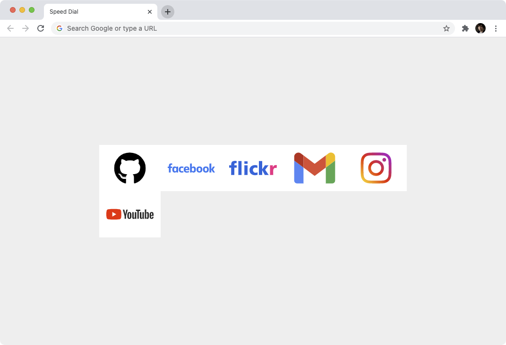

# Speed Dial

A minimalistic chrome extension implementing old good Opera's Speed Dial.
Clean. Personalized. Performant. Flicker free.

[Live demo](https://azproduction.github.io/speed-dial/newtab.html)

## Motivation for creating it

Every single extension I tried was slow, it flickered any time I open a new tab,
had a ton of annoyances or lack of customisation.

## Features

 * Just my favourite sites on a classical #eee background.
 * No annoyances. News, backgrounds, bookmarks, search bar – all gone.
 * It does not use any JS to keep page loading time as close to 1ms as possible.
 * It uses inlined SVG icons to prevent image flicker when creating a new tab.

## Installing

 * Clone this repo to your hard drive.
 * Enable Developer mode in `chrome://extensions`.
 * Load unpacked extension. Point to directory of this repo.

## Customisation

 * Clone this repo.
 * Edit newtab.html page: change background, replace sites, add round corners and margins.

## Synchronisation between browsers

 * Just git clone your repo.
 * Git pull on target machine.

## Getting Logos

 * https://www.logo.wine/
